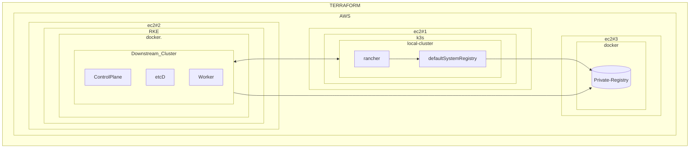

# Terraform EC2 Rancher Downstream

Debug Default Private Registry problem with `Rancher2` provider `rancher2_app_v2` resource.

---

## Debugging  Architecture



---

# How to execute and validate

1. Run `terraform init && terraform apply --auto-approve`:
2. Wait for it to deploy and check if everything is working:
    - [X] Rancher server
    - [X] Downstream Cluster

---

## Debugging Utilities

### K3s Images for Bundled mode

```
curl -L "https://github.com/k3s-io/k3s/releases/download/v1.25.9+k3s1/k3s-images.txt" -o files/k3s-images.txt --compressed

curl -L "https://github.com/k3s-io/k3s/releases/download/v1.25.9+k3s1/k3s-airgap-images-${ARCH}.tar" -o files/k3s-airgap-images-amd64.tar


docker run -d --restart=always \
    -p 5000:5000 \
    --name "defaultregistry" \
    -v /home/ubuntu/volume:/var/lib/registry \
    registry:2


helm template "files/cert-manager-v1.12.3.tgz" | \
        awk '$1 ~ /image:/ {print $2}' | sed s/\"//g >> files/rancher-images.txt
```

#### Get cloud-init provisioner logs

```
tail -f /var/log/cloud-init-output.log -n 100000
```

---

#### HTTPS + SSL at Private Registry

Generate the Self-signed certificate at the Private Registry Machine:
```
echo "Generating TLS certificates"
mkdir -p /home/ubuntu/certs
openssl req -newkey rsa:4096 -nodes -sha256 -keyout /home/ubuntu/certs/domain.key -x509 -days 365 -out /home/ubuntu/certs/domain.crt -subj "/CN=$PUBLIC_DNS"

echo "creating volume dir at /home/ubuntu"
sudo mkdir -p /home/ubuntu/volume
echo "changing permissions"
sudo chmod +rw /home/ubuntu/volume

echo "Running Docker Registry with TLS"
docker run -d --restart=always \
        -p 5000:5000 \
        --name "defaultregistry" \
        -v /home/ubuntu/volume:/var/lib/registry \
        -v /home/ubuntu/certs:/certs \
        -e REGISTRY_HTTP_ADDR=0.0.0.0:5000 \
        -e REGISTRY_HTTP_TLS_CERTIFICATE=/certs/domain.crt \
        -e REGISTRY_HTTP_TLS_KEY=/certs/domain.key \
        registry:2
```

Copy these certificates to all Rancher Cluster managed nodes:

---

### Node Command Example
```
sudo docker run -d --privileged --restart=unless-stopped --net=host -v /etc/kubernetes:/etc/kubernetes -v /var/run:/var/run  rancher/rancher-agent:v2.7.5 --server https://rancher.18.117.168.196.sslip.io --token kmkflxhwjfcf5scbjcsrr7kmh59kqj78wtdnmz7mhlnc6fp7zq6dnc --ca-checksum 5f8b308fa5f88fdc12749aa991901e54784ec61b36255319bdcf4d00d3734433"

# structured
sudo docker run -d --privileged --restart=unless-stopped --net=host -v /etc/kubernetes:/etc/kubernetes \
    -v /var/run:/var/run  ec2-18-217-230-142.us-east-2.compute.amazonaws.com:5000/rancher/rancher-agent:v2.7.5 \
    --server https://rancher.18.116.40.118.sslip.io \
    --token n22wlx598kkpln557kmnxrtkjrzfjgpgf25dxs59hl4kx4m92564lf \
    --ca-checksum 093ba96bbdf7ae1c690f03fec2380fb4ee1a08eceea7d28a761032ecd0c65f8d \
    --address $publicIP --internal-address $privateIP --controlplane --etcd --worker

# calling
./bug_node_cmd.sh 'sudo docker run -d --privileged --restart=unless-stopped --net=host -v /etc/kubernetes:/etc/kubernetes -v /var/run:/var/run  ec2-13-58-41-102.us-east-2.compute.amazonaws.com:5000/rancher/rancher-agent:v2.7.5 --server https://rancher.18.221.171.6.sslip.io --token rf4wqd87tcb624wtccp6jk2ctr727mkcbn9d5ds5kwxlqdcdmbwj8q --ca-checksum 509c80f314180181359b9602e3a50a86f9c32fe99ded149356a9a0f24a1e704c' ec2-13-58-41-102.us-east-2.compute.amazonaws.com:5000

```

### Testing connectivity from Bug Node -> Private Registry:
```
docker pull ec2-3-144-6-67.us-east-2.compute.amazonaws.com:5000/rancher/fleet-agent:v0.7.0

curl --insecure https://PUBLIC_DNS:5000/v2/_catalog

curl -v ec2-18-216-242-109.us-east-2.compute.amazonaws.com:5000/v2/rancher/fleet-agent/manifests/v0.7.0
```

---

## Debugging RKE containers

```
# see the logs
docker logs kube-apiserver
docker logs kube-controller-manager
docker logs kube-scheduler
docker logs kubelet

# save locally the logs
docker logs kube-apiserver > kube-apiserver.txt
docker logs kube-controller-manager > kube-controller-manager.txt
docker logs kube-scheduler > kube-scheduler.txt
docker logs kubelet > kubelet.txt

# download from ec2
scp -i ./certs/id_rsa ubuntu@ec2-18-226-150-187.us-east-2.compute.amazonaws.com:~/kube-apiserver.txt .
scp -i ./certs/id_rsa ubuntu@ec2-18-226-150-187.us-east-2.compute.amazonaws.com:~/kube-controller-manager.txt .
scp -i ./certs/id_rsa ubuntu@ec2-18-226-150-187.us-east-2.compute.amazonaws.com:~/kube-scheduler.txt .
scp -i ./certs/id_rsa ubuntu@ec2-18-226-150-187.us-east-2.compute.amazonaws.com:~/kubelet.txt .

# get inside the containers
docker exec -it  kube-apiserver /bin/sh
docker exec -it  kube-controller-manager /bin/sh
docker exec -it  kube-scheduler /bin/sh
docker exec -it  kubelet /bin/sh

# see events
kubectl get events --all-namespaces
```

---

# Log Debugging - RKE Containers

### `kube-controller-manager Error:`

```
error retrieving resource lock kube-system/kube-controller-manager: Get "https://127.0.0.1:6443/apis/coordination.k8s.io/v1/namespaces/kube-system/leases/kube-controller-manager?timeout=5s": dial tcp 127.0.0.1:6443: connect: connection refused
```

This is often a sign that the API server is not running or not accessible at the expected address.

### `kube-apiserver Error:`

shows a warning related to the etcd client:

```
"retrying of unary invoker failed".
```

Might be connectivity issues with the etcd server, which is critical for the API server's operation.

The API server relies on etcd for storing all cluster data.

### `kube-scheduler Error:`

```
(dial tcp 127.0.0.1:6443: connect: connection refused).
```

API server is either down or not reachable.

### `kubelet Error:`

```
The kubelet log Failed to create sandbox for pod...manifest for [registry URL]/rancher/mirrored-pause:3.7 not found: manifest unknown:
```

Issue with pulling a required image from your private registry.

The `mirrored-pause image` is a basic container used by Kubernetes for various internal operations.

If the kubelet can't pull this image, it won't be able to start any pods.
